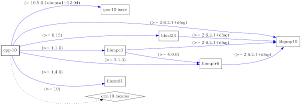

# Отбор на SRE week

[A. Высокая нагрузка](https://github.com/danula-ded/Test_SRE-week/blob/main/A/code.py)
===================
<table>
    <tr>
        <td>Ограничение времени</td>
        <td>1&nbsp;секунда</td>
    </tr>
        <tr>
        <td>Ограничение памяти</td>
        <td>256Mb</td>
    </tr>
        <tr>
        <td>Ввод</td>
        <td>стандартный ввод или input.txt</td>
    </tr>
        <tr>
        <td>Вывод</td>
        <td>стандартный вывод или output.txt</td>
    </tr>
</table>
У вас есть запись сессий на неком вымышленном сервисе. Каждая сессия описывается моментом начала и конца, обозначаемыми si и fi, причем все эти моменты уникальны.

Вам нужно найти начало отрезка времени, t, на котором было активно максимальное число сессий. Иными словами, найдите такой момент времени t, для которого максимально количество индексов i, для которых выполняется условие si ≤ t ≤ fi. Если есть несколько отрезков времени с одинаковой максимальной нагрузкой, выбирайте самый ранний из них.

Формат ввода
------------

В первой строке входных данных записано одно целое число n (1 ≤ n ≤ 1000). Далее в n строках записано по два числа si и fi (0 ≤ si < fi ≤ 1000000000).

Формат вывода
-------------

В единственной строке выведите искомый момент времени t.

### Пример 1

```Ввод
3
3 4
1 6
0 7
```

``` Вывод
3
```

### Пример 2

``` Ввод
5
4 5
0 3
1 9
7 8
2 6
```

``` Вывод
2
```


[B. Зависимость](https://github.com/danula-ded/Test_SRE-week/blob/main/B/code.py)
==============
<table>
    <tr>
        <td>Ограничение времени</td>
        <td>1&nbsp;секунда</td>
    </tr>
        <tr>
        <td>Ограничение памяти</td>
        <td>256Mb</td>
    </tr>
        <tr>
        <td>Ввод</td>
        <td>стандартный ввод или input.txt</td>
    </tr>
        <tr>
        <td>Вывод</td>
        <td>стандартный вывод или output.txt</td>
    </tr>
</table>
При установке какого-либо пакета в операционной системе Linux необходимо учитывать сложную взаимосвязь пакетов между собой. Если пакет А зависит от пакета Б, а тот — от пакета В, то сначала следует установить В, потом Б и лишь потом — А. Таким образом при запросе на установку необходимо сформировать список пакетов и расположить их в том порядке, в котором их можно устанавливать. Если попробовать сначала установить пакет Б, а лишь потом В — возникнет ошибка. К счастью, мы можем посмотреть на зависимости конкретного пакета, выполнив следующую команду:

$ debtree --no-alternatives --no-recommends --no-provides --no-conflicts cpp-10 > cpp-10.dot

Данная команда создаст файл cpp-10.dot, в котором будет вся необходимая нам информация. Для пакета cpp-10 данный файл выглядит следующим образом:

digraph "cpp-10" {    
    rankdir=LR;    
    node \[shape=box\];    
    "cpp-10" -> "gcc-10-base" \[color=blue,label="(= 10.5.0-1ubuntu1~22.04)"\];    
    "cpp-10" -> "libgmp10" \[color=blue,label="(>= 2:6.2.1+dfsg)"\];    
    "cpp-10" -> "libisl23" \[color=blue,label="(>= 0.15)"\];    
    "libisl23" -> "libgmp10" \[color=blue,label="(>= 2:6.2.1+dfsg)"\];    
    "cpp-10" -> "libmpc3" \[color=blue,label="(>= 1.1.0)"\];    
    "libmpc3" -> "libgmp10" \[color=blue,label="(>= 2:6.2.1+dfsg)"\];    
    "libmpc3" -> "libmpfr6" \[color=blue,label="(>= 4.0.0)"\];    
    "libmpfr6" -> "libgmp10" \[color=blue,label="(>= 2:6.2.1+dfsg)"\];    
    "cpp-10" -> "libmpfr6" \[color=blue,label="(>= 3.1.3)"\];    
    "cpp-10" -> "libzstd1" \[color=blue,label="(>= 1.4.0)"\];    
    "cpp-10" -> "gcc-10-locales" \[style=dotted,label="(>= 10)"\];    
    "cpp-10" \[style="setlinewidth(2)"\]    
    "gcc-10-locales" \[shape=diamond\];    
}    
// Excluded dependencies:    
// libc6 zlib1g    
// total size of all shown packages: 46455808    
// download size of all shown packages: 14076678

Здесь нам интересны строки, в которых присутствует подстрока ”->”, обозначающая зависимость одного пакета от другого. Например, cpp-10, напрямую зависит от libisl23, а libisl23 - от libgmp10 и т.д.

Вам предлагается собрать информацию о зависимостях между пакетами из подобного и вывести их названия в том порядке, в котором их можно устанавливать.

Кстати, вы можете сохранить диаграмму в PNG формате и посмотреть на граф зависимостей выполнив команду:

$ dot -T png -o cpp-10.png cpp-10.dot

Для пакета cpp-10 граф зависимостей выглядит следующим образом:



Формат ввода
------------

В качестве входного файла используется результат выполнения следующей команды для одного из пакетов:

$ debtree --no-alternatives --no-recommends --no-provides --no-conflicts <package-name>

В списке отсутствуют альтернативные пакеты, дополнительные рекомендации и циклические зависимости. Обратите внимание, что в начале строк, которые описывают зависимости утилита debtree ставит символ табуляции.

Формат вывода
-------------

Список имен пакетов, в том порядке, в котором их можно устанавливать. Каждое имя на новой строке.

Пример
------

``` Ввод
digraph "adduser" {
	rankdir=LR;
	node \[shape=box\];
	"adduser" -> "passwd" \[color=blue\];
	"adduser" -> "debconf" \[color=blue,label="(>= 0.5)"\];
	"adduser" \[style="setlinewidth(2)"\]
	"debconf" \[shape=diamond\];
	"passwd" \[shape=diamond\];
}
// total size of all shown packages: 622592
// download size of all shown packages: 155528
```
``` Вывод
debconf
passwd
adduser
```
